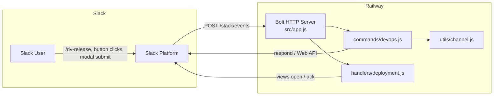
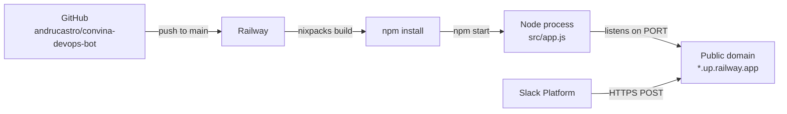

# Convina DevOps Bot — Architecture

Reference document for project structure, runtime behavior, deployment, and Slack integration.  
For chronological change history, see [`AUTO_README.md`](./AUTO_README.md).

---

## System Overview

**Convina DevOps Bot** is a Slack application that lets team members trigger DevOps workflows from Slack. It is built on **Node.js** and **@slack/bolt**, deployed to **Railway**, and communicates with Slack over **HTTP** (not Socket Mode).

| Item | Value |
|------|-------|
| Repo | https://github.com/andrucastro/convina-devops-bot |
| Production | https://convina-devops-bot.onrender.com |
| Slack endpoint | `/slack/events` |
| Entry point | `src/app.js` |

---

## High-Level Architecture



---

## Request Flow

### 1. Slash command (`/dv-release`)

```
User types /dv-release
  → Slack POSTs to /slack/events
  → devops.js: ack()
  → channel.js: ensureBotInChannel() [optional check]
  → devops.js: respond() with ephemeral Block Kit menu
```

Uses `respond()` (via Slack `response_url`), so the bot does **not** need channel membership for the initial menu.

### 2. Button click (`create_deployment_request`)

```
User clicks "Create Deployment Request"
  → Slack POSTs block_actions to /slack/events
  → deployment.js: ack()
  → deployment.js: client.views.open() → modal
```

Requires **Interactivity** enabled in the Slack app settings.

### 3. Modal submit (`deployment_request_modal`)

```
User submits modal
  → Slack POSTs view_submission to /slack/events
  → deployment.js: ack()
  → Parse form values → log request (TODO: notify / CI/CD / DB)
```

---

## Project Structure

```
convina-devops-bot/
├── src/
│   ├── app.js                  # Bootstraps Bolt, registers modules, starts server
│   ├── commands/               # Slash command handlers
│   │   └── devops.js           # /dv-release command
│   │   └── apps.js             # /dv-add-app, /dv-edit-app, /dv-delete-app
│   ├── db/
│   │   └── supabase.js         # Supabase client (secret key)
│   ├── handlers/               # Interactive handlers (actions, views)
│   │   └── deployment.js       # Deployment button + modal
│   │   └── apps.js             # Add/edit/delete app modal submissions
│   ├── services/
│   │   └── deploymentRequests.js # Ticket create/update/get
│   │   └── apps.js             # Apps CRUD
│   └── utils/                  # Shared helpers
│       └── channel.js          # Channel membership checks
├── sql/
│   └── deployment_requests.sql # Table schema for Supabase
├── .cursor/rules/              # Cursor AI rules
├── ARCHITECTURE.md             # This file — stable architecture reference
├── AUTO_README.md              # Living session / change log
├── railway.toml                # Railway deploy config
├── package.json
├── .env                        # Local secrets (gitignored)
└── .env.example
```

### Module Responsibilities

| Module | Role |
|--------|------|
| `app.js` | Create Bolt `App`, load env, register commands/handlers, listen on `PORT` |
| `commands/devops.js` | Handle `/dv-release`; show ephemeral action menu |
| `commands/apps.js` | Handle `/dv-add-app`, `/dv-edit-app`, and `/dv-delete-app` modals |
| `handlers/deployment.js` | Open deployment modal; save ticket; confirm to user |
| `handlers/apps.js` | Persist add/edit/delete app modal submissions |
| `db/supabase.js` | Supabase client using secret/service role key |
| `services/apps.js` | List/create/update/delete apps |
| `services/deploymentRequests.js` | Persist and fetch deployment tickets |
| `utils/channel.js` | Verify bot channel membership; show invite instructions |

### Registration Pattern

Modules export a function that receives the Bolt `app` instance:

```javascript
module.exports = (app) => {
  app.command('/dv-release', async ({ ack, respond }) => { ... });
};
```

`app.js` wires them up:

```javascript
registerDevopsCommands(app);
registerDeploymentHandlers(app);
```

---

## Slack Integration

### Transport Mode

| Environment | Mode | How Slack reaches the app |
|-------------|------|---------------------------|
| Production (Railway) | HTTP | Public URL → `POST /slack/events` |
| Local (current) | HTTP + ngrok | Temporarily point Slack URLs to ngrok tunnel |

Socket Mode is **not** configured. For local dev without URL switching, see [Local Development](#local-development).

### Required Slack App Settings

| Setting | Value |
|---------|-------|
| Slash Commands → `/dv-release`, `/dv-add-app`, `/dv-edit-app`, `/dv-delete-app` Request URL | `https://convina-devops-bot.onrender.com/slack/events` |
| Interactivity & Shortcuts Request URL | `https://convina-devops-bot.onrender.com/slack/events` |

### OAuth Scopes (current)

| Scope | Purpose |
|-------|---------|
| `commands` | Slash commands |
| `chat:write` | Post messages (future channel notifications) |
| `chat:write.customize` | Custom message appearance |
| `channels:history` | Read public channel history |
| `im:history` | Read DM history |
| `users:read` | Resolve user info |
| `users.profile:read` | User profile data |
| `search:read.users` | User search |
| `app_mentions:read` | App mentions |
| `incoming-webhook` | Incoming webhooks |

### Optional Scopes (channel membership check)

| Scope | Purpose |
|-------|---------|
| `channels:read` | Check public channel membership |
| `groups:read` | Check private channel membership |
| `channels:join` | Auto-join public channels |

Without these, `channel.js` skips the membership check and logs a warning.

### Private Channels

Installing the app to a workspace does **not** add the bot to private channels. Invite explicitly:

```
/invite @YourBotName
```

---

## Deployment

### Platform: Railway



### `railway.toml`

```toml
[build]
builder = "nixpacks"

[deploy]
startCommand = "npm start"
restartPolicyType = "ON_FAILURE"
```

Valid `restartPolicyType` values: `ON_FAILURE`, `ALWAYS`, `NEVER`.

### Environment Variables

| Variable | Local | Railway | Required |
|----------|-------|---------|----------|
| `SLACK_BOT_TOKEN` | `.env` | Dashboard | Yes |
| `SLACK_SIGNING_SECRET` | `.env` | Dashboard | Yes |
| `SUPABASE_URL` | `.env` | Dashboard | Yes |
| `SUPABASE_SECRET_KEY` or `SUPABASE_SERVICE_ROLE_KEY` | `.env` | Dashboard | Yes |
| `PORT` | `3000` (optional) | Auto-injected | No — Railway sets this |

Never commit `.env` to git.

### Deploy Workflow

1. Push to `main` on GitHub
2. Railway auto-builds and deploys
3. Verify logs: `Bolt app running on port ...`
4. Test `/dv-release` in Slack

---

## Local Development

### Quick Start

```bash
npm install
cp .env.example .env   # if you add one; otherwise create .env manually
npm run dev            # nodemon on port 3000
```

### HTTP Mode (current)

Slack only sends events to the URL configured in app settings. For local testing:

```bash
npm run dev
ngrok http 3000
```

Temporarily set Slack URLs to `https://<ngrok-id>.ngrok.io/slack/events`, then switch back to Railway when done.

### Recommended Alternatives

| Approach | Pros |
|----------|------|
| **Socket Mode** (not yet implemented) | No ngrok; no URL switching |
| **Separate dev Slack app** | Prod and dev URLs stay independent |
| **Test on Railway** | No local Slack config changes |

---

## Error Handling Strategy

| Layer | Behavior |
|-------|----------|
| `channel.js` | Catches `missing_scope`, `not_in_channel`, `channel_not_found`; never crashes the process |
| `devops.js` | Top-level try/catch; sends user-friendly ephemeral error via `respond()` |
| `deployment.js` | Should follow same pattern as handlers grow |

### Slack API Patterns

| Use case | Method |
|----------|--------|
| Slash command reply | `respond()` — works without channel membership |
| Post to channel | `client.chat.postMessage()` — bot must be in channel |
| Ephemeral in channel | `client.chat.postEphemeral()` — bot must be in channel |
| Open modal | `client.views.open()` — uses `trigger_id` from interaction |

---

## Data Layer (Supabase)

Tickets are stored in Postgres via Supabase.

### Table: `deployment_requests`

| Column | Type | Notes |
|--------|------|-------|
| `id` | uuid | Primary key |
| `ticket_number` | bigserial | Used as human id `DEP-<n>` |
| `app_id` | uuid | FK → `apps.id` |
| `service` | text | Legacy fallback display name (nullable) |
| `environment` | text | `staging` \| `production` |
| `batch_start` | date | Required — calendar start |
| `batch_end` | date | Required — calendar end (`>= batch_start`) |
| `description` | text | Optional |
| `requested_by` | text | Slack user id |
| `status` | text | `pending` (default), `approved`, `rejected`, `deployed`, `cancelled`, `completed` |
| `channel_id` | text | Slack channel where request started |
| `message_ts` | text | For future trackable channel messages |
| `created_at` / `updated_at` | timestamptz | Auto-managed |

### Table: `apps`

| Column | Type | Notes |
|--------|------|-------|
| `id` | uuid | Primary key |
| `name` | text | Unique app/service name |

Schema files:
- `sql/apps.sql` — create + seed apps
- `sql/migrate_add_app_id.sql` — add `app_id` to existing tickets table
- `sql/deployment_requests.sql` — full fresh-install schema

**RLS:** Enabled on both tables with no anon/authenticated policies (deny by default).  
The bot uses `SUPABASE_SECRET_KEY` / `SUPABASE_SERVICE_ROLE_KEY`, which **bypasses RLS**, so create/update still works.

Create flow:

```
Modal submit
  → services/deploymentRequests.createDeploymentRequest()
  → insert into deployment_requests
  → ephemeral Slack confirmation with DEP-<ticket_number>
  → "Mark as Completed" button updates status → completed and refreshes the message
  → Open Requests list also offers Delete (removes DB row + channel message when possible)
```

If the table was created before `completed` was added, run `sql/add_completed_status.sql`.

---

## Extension Points (TODO)

- [x] Persist requests to a database (Supabase)
- [x] Quick action: Mark as Completed on ticket summary
- [x] Open Requests list from `/dv-release`
- [x] Delete open request from Open Requests list
- [x] Completed Requests list from `/dv-release`
- [x] Post trackable confirmation message to a DevOps channel
- [ ] More status buttons (approve / reject)
- [ ] Trigger CI/CD pipeline (GitHub Actions, Railway, etc.)
- [ ] Socket Mode for local development
- [ ] Health check endpoint (`/health`) for Railway monitoring

To add a new slash command: create `src/commands/<name>.js`, register in `app.js`.  
To add a new workflow: create `src/handlers/<name>.js`, register in `app.js`.

---

## Documentation Map

| File | Purpose | Update when |
|------|---------|-------------|
| `ARCHITECTURE.md` | Stable architecture, setup, deployment | Structure, integrations, or deploy model changes |
| `AUTO_README.md` | Chronological change log | Any feature, fix, or config change |
| `.cursor/rules/auto-readme-context.mdc` | Cursor AI instructions | Doc workflow changes |

---

*Last updated: July 22, 2026*
